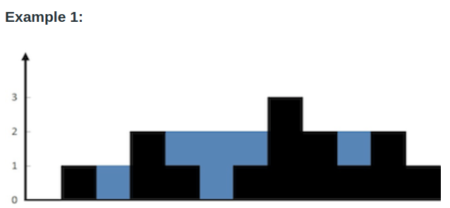

# 42. Trapping Rain Water

Given <code>n</code> non-negative integers representing an elevation map where the width of each bar is <code>1</code>, compute how much water it can trap after raining

## Example 1

    Input: height = [0,1,0,2,1,0,1,3,2,1,2,1]
    Output: 6

## Example 2

    Input: height = [4,2,0,3,2,5]
    Output: 9

## Constraints

- <code> n == height.length </code>
- <code> 1 <= n <= 2 * 104 </code>
- <code> 0 <= height[i] <= 105 </code>
